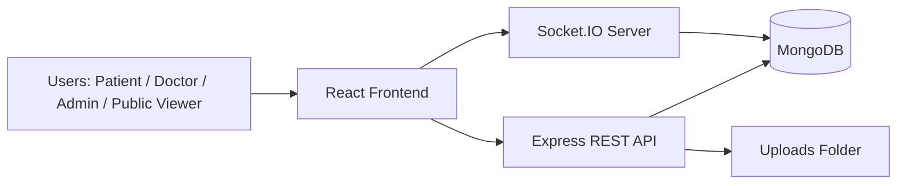
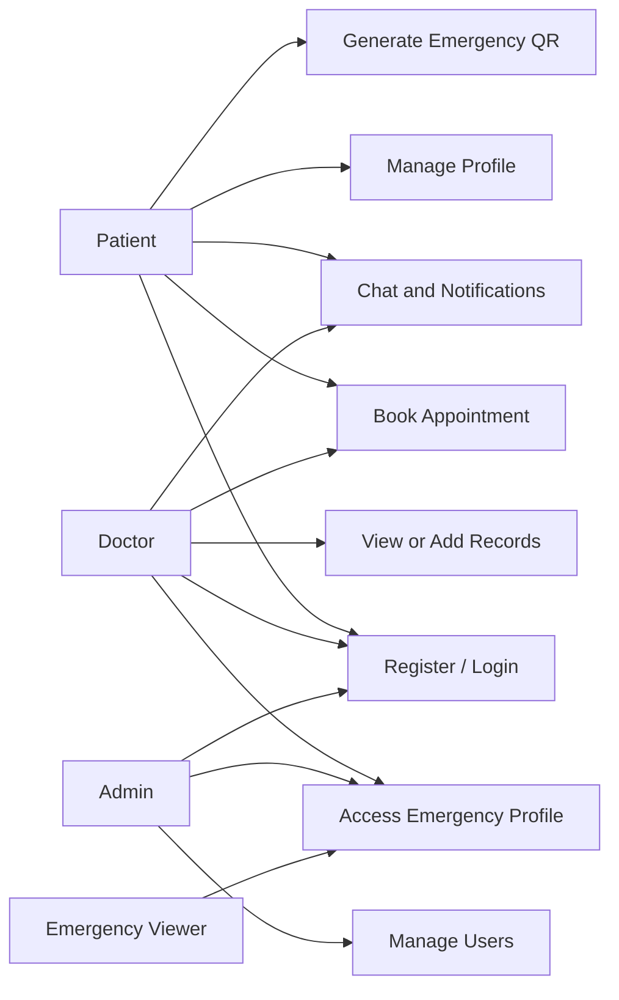
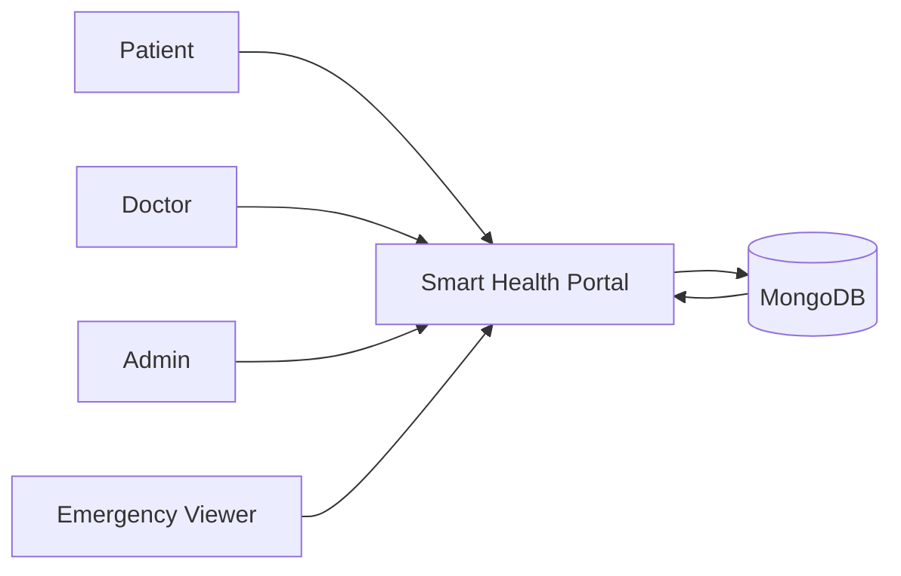
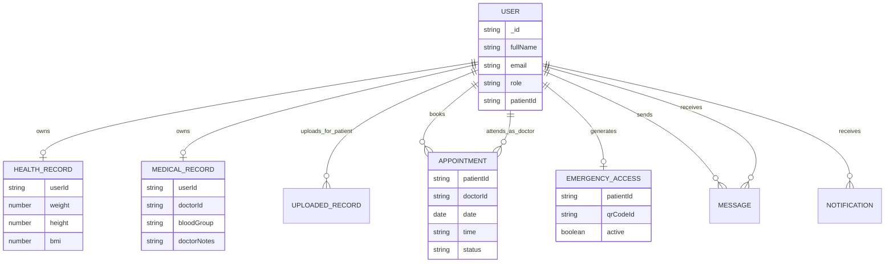
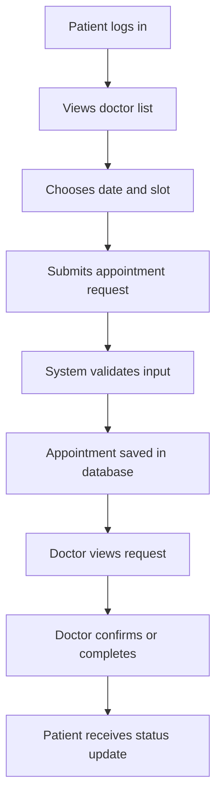
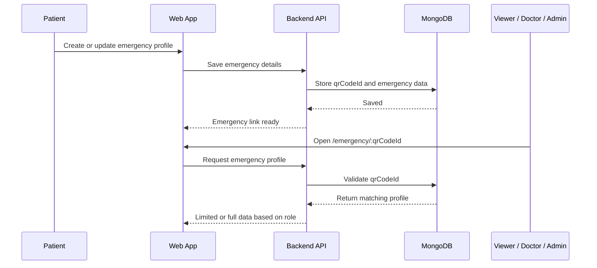
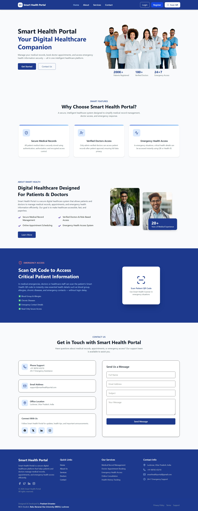

# Smart Health Portal
## A Secure Patient-Doctor Medical Record Management System

**Presented by:** Prashant Srivastav  
**Course:** MCA IV Semester  
**University:** BBDU  
**Session:** April 2026

---

# Abstract

Smart Health Portal is a full-stack healthcare web application designed to digitize patient records and provide secure access to patients, doctors, and administrators.

The system combines:

- role-based authentication
- digital health and medical records
- appointment booking and status tracking
- real-time doctor-patient communication
- emergency QR-based medical access

This project reduces dependency on paper records and improves healthcare accessibility, coordination, and safety.

---

# Problem Statement

Traditional healthcare workflows still face major operational issues:

- records are scattered across paper files and isolated systems
- patients struggle to carry complete medical history during emergencies
- doctors and patients lack a centralized communication channel
- appointment handling is often manual and inefficient
- sensitive data may be duplicated, lost, or accessed insecurely

These problems increase delay, inconsistency, and risk in patient care.

---

# Proposed Solution

The Smart Health Portal provides a centralized and secure web platform where:

- patients manage profiles, health data, and appointments
- doctors access authorized patient information and update records
- admins supervise users and platform operations
- emergency responders can view limited critical patient data through QR-based access

The solution integrates REST APIs, real-time messaging, and role-based protection in one system.

---

# Objectives

- Digitize healthcare records in a structured format
- Provide secure access using JWT-based authentication
- Enable patient-doctor communication through chat
- Simplify appointment booking and tracking
- Support emergency access using QR-linked patient profiles
- Improve transparency, speed, and reliability of healthcare data management

---

# Scope and User Roles

## In Scope

- authentication and authorization
- profile and health record management
- medical file upload and access
- appointments, notifications, and messaging
- emergency QR-based access

## User Roles

- **Patient:** manages profile, books appointments, chats, maintains emergency info
- **Doctor:** views patient data, adds records, updates appointment status, chats
- **Admin:** manages users and protected system functions
- **Public Emergency Viewer:** sees limited life-saving details through QR access

---

# Technology Stack

## Frontend

- React 19
- TypeScript
- Vite
- Tailwind CSS
- Ant Design
- Socket.IO Client

## Backend

- Node.js
- Express.js
- MongoDB with Mongoose
- JWT authentication
- Multer for uploads
- Socket.IO

---

# Development Approach

## Software Engineering Model: Prototype Model

This model was suitable because healthcare workflows require repeated feedback and refinement.

### Why it fits this project

- early interface and workflow validation
- easier correction of user-role requirements
- iterative improvement of modules like chat and emergency access
- reduced mismatch between expected and actual functionality

### Major phases

Requirement Analysis -> Design -> Backend -> Frontend -> Integration -> Testing -> Documentation

---

# High-Level Architecture

**Architecture style:** 3-tier web architecture with REST + WebSocket communication.

---

# Major System Modules

- **Authentication Module:** registration, login, JWT session handling
- **User Module:** profile view, profile update, role-aware data access
- **Health Record Module:** height, weight, BMI, blood pressure, core health metrics
- **Medical Record Module:** allergies, diseases, medications, notes, emergency data
- **Uploaded Records Module:** report and prescription file storage
- **Appointment Module:** booking, status updates, cancellation, slot flow
- **Chat Module:** doctor-patient messaging using Socket.IO
- **Notification Module:** appointment and system notifications
- **Emergency Module:** QR-linked emergency patient access
- **Admin Module:** manage patients, doctors, and role-based controls

---

# Use Case View

---

# Data Flow Diagram - Level 0

This shows the portal as a centralized data-processing system serving all user types.

---

# Database Design - ER Diagram

---

# Appointment Booking Workflow

This flow reduces manual coordination and keeps appointment status transparent for both sides.

---

# Emergency QR Access Sequence

---

# Security Design

- JWT-based authentication for protected APIs
- role-based authorization for patient, doctor, and admin routes
- protected admin-only operations
- optional authentication for emergency access
- limited public emergency view and broader doctor/admin clinical view
- MongoDB-based centralized data storage with structured model validation
- file uploads handled through server middleware
- Socket.IO communication protected through authenticated sessions

**Security goal:** provide access on a need-to-know basis without blocking emergency use cases.

---

# Testing Strategy

## Testing Focus

- authentication testing
- role-based access testing
- appointment workflow testing
- record upload and retrieval testing
- chat and notification testing
- emergency QR lookup testing

## Sample Test Cases

| Test Case | Input | Expected Result |
| --- | --- | --- |
| Login | Valid credentials | User redirected to dashboard |
| Login | Invalid password | Error message shown |
| Book appointment | Valid date and doctor | Appointment created |
| Update appointment | Doctor confirms status | Patient sees updated status |
| Upload record | Valid file and metadata | File stored successfully |
| Emergency lookup | Valid QR URL | Emergency profile displayed |

---

# Key Outcomes

- centralized patient data management
- better communication between doctor and patient
- quick access to critical emergency information
- reduced dependency on paper-based workflows
- modular architecture that supports future expansion

This project demonstrates practical use of full-stack development, REST APIs, database design, authentication, and real-time systems in healthcare.

---

# Sample Interface

**Screens demonstrated in the system**

- home page and role-based entry flow
- dashboard pages
- appointment management
- patient-doctor chat
- emergency patient profile access

---

# Advantages

- Paperless and centralized healthcare workflow
- Faster access to medical information
- Better patient-doctor coordination
- Emergency-friendly design using QR access
- Secure and scalable module separation
- Useful as both an academic project and a practical prototype

---

# Limitations

- no hospital ERP or laboratory system integration yet
- no payment gateway or billing module
- uploaded files are stored locally instead of cloud storage
- advanced analytics and decision support are not included
- public emergency access is intentionally limited to essential data only

---

# Future Scope

- mobile application for Android/iOS
- cloud storage for uploaded reports
- AI-based health recommendations or triage support
- QR code image generation and printable cards
- hospital and pharmacy integration
- video consultation and e-prescription support
- audit logs and advanced security monitoring

---

# Conclusion

Smart Health Portal successfully addresses major problems in conventional healthcare record handling by offering a secure, centralized, and user-friendly web solution.

The system integrates authentication, appointments, digital medical records, messaging, notifications, and emergency QR access into one platform, making it a strong MCA project with real-world relevance.

---

# Thank You
## Questions and Discussion

