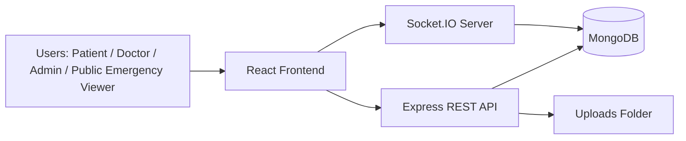
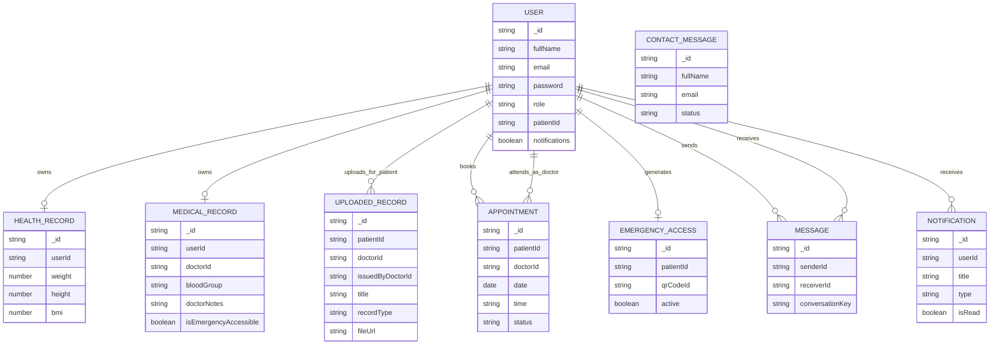
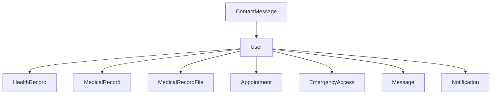
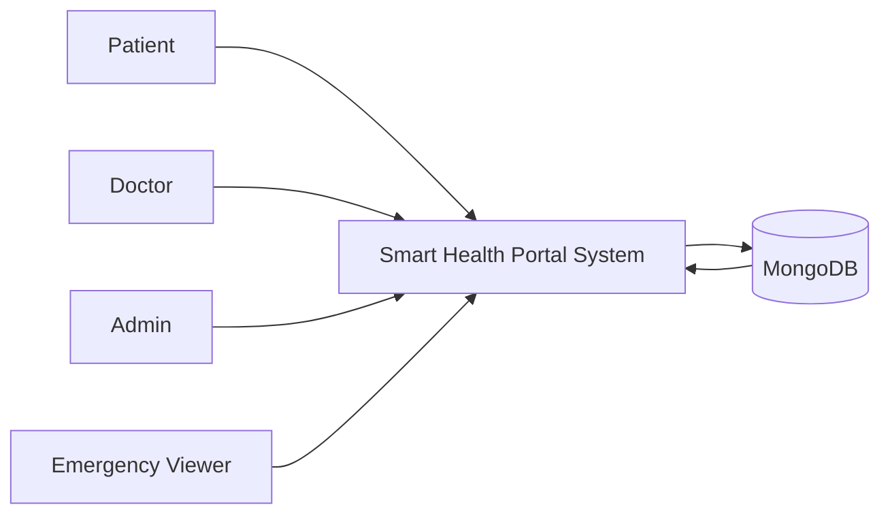
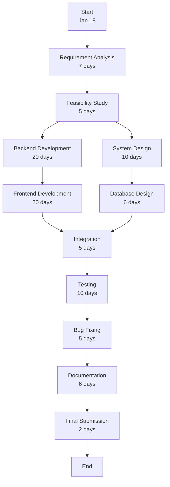
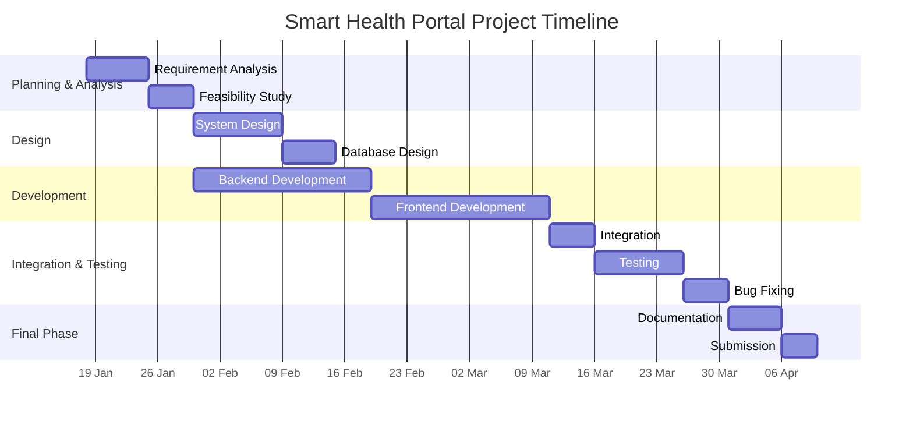
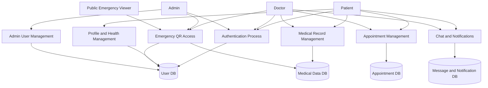

# Smart Health Portal

## Project Title

Smart Health Portal - A Secure Patient-Doctor Medical Record Management System

## Abstract

Smart Health Portal is a full-stack healthcare web application developed to digitize patient medical data and provide secure, role-based access to doctors, patients, and administrators. The system reduces dependency on paper-based records, simplifies appointment and communication workflows, and introduces emergency access through QR-based patient identification. The project is designed as an MCA-level academic project using the MERN-style ecosystem with React on the frontend and Node.js, Express, and MongoDB on the backend.

## Problem Statement

Traditional healthcare record handling suffers from several practical issues:

- Patient data is often scattered across paper files or isolated systems.
- Doctors may not get complete medical history at the right time.
- Emergency treatment is delayed when critical details are unavailable.
- Communication between doctor and patient is not centralized.
- Medical files are difficult to track, organize, and share securely.
- Administrative supervision of users and records is limited.

## Proposed Solution

The Smart Health Portal provides a centralized digital platform where:

- Patients can register, manage their profile, and upload medical documents.
- Doctors can access patient-related information and communicate with patients.
- Admins can manage users across roles.
- Appointments can be booked and tracked.
- Emergency data can be accessed quickly using a QR code.
- Notifications and real-time chat improve communication.

## Objectives

- To build a secure medical record management platform.
- To implement role-based access for patient, doctor, and admin users.
- To provide emergency medical access using QR-based lookup.
- To enable appointment booking and status management.
- To support medical report upload and structured health information storage.
- To offer real-time doctor-patient messaging.
- To create a scalable and report-ready academic healthcare solution.

## Scope

### In Scope

- User authentication and authorization
- Patient profile and health record management
- Medical file upload and viewing
- Emergency QR generation and lookup
- Appointment management
- Notifications
- Real-time chat
- Admin user management
- Contact/support form

### Out of Scope

- Direct hospital, laboratory, or insurance integration
- Electronic prescription signing
- AI-based diagnosis
- Cloud object storage and advanced encryption-at-rest
- Payment and billing management

## User Roles

### Patient

- Register and log in
- Update personal profile
- Maintain health record details
- Upload medical reports and attachments
- Book appointments
- Use chat with doctors
- Generate emergency QR profile

### Doctor

- Log in and access patient list
- View patient-accessible profiles
- Add uploaded records for patients
- Confirm or complete appointments
- Use real-time chat with patients
- Access full emergency clinical data when logged in

### Admin

- Manage doctors and patients
- Create, update, and delete users
- View user details
- Access system data through protected admin routes

## Major Features

- JWT-based authentication
- Role-based authorization
- Patient profile management
- Health record CRUD
- Structured clinical record storage
- Multi-attachment medical report upload
- Appointment booking with slot availability
- Emergency QR access
- Real-time messaging using Socket.IO
- Notification panel
- Admin dashboard user management
- Contact form for public users

## Technology Stack

### Frontend

- React 19
- TypeScript
- Vite
- Tailwind CSS
- Ant Design
- React Router
- Socket.IO Client
- html5-qrcode

### Backend

- Node.js
- Express.js
- TypeScript
- MongoDB
- Mongoose
- JWT
- bcryptjs
- Multer
- Socket.IO

## High-Level Architecture



## System Modules

### 1. Authentication Module

- Patient and doctor registration
- Login for all valid users
- JWT token creation
- Protected route access with middleware

### 2. User Module

- View current user profile
- Update profile fields
- Fetch doctors
- Fetch patients for doctor/admin users
- View accessible profile details

### 3. Health Record Module

- Store health metrics such as weight, height, BMI, and blood pressure
- Update or delete health record

### 4. Medical Record Module

- Store structured medical details such as medications, allergies, diseases, blood group, emergency contact, reports, and doctor notes

### 5. Uploaded Record Module

- Upload files using Multer
- Store document metadata such as title, type, issue date, issuer, and attachments
- Allow patients and doctors to view records by role

### 6. Appointment Module

- Book appointments
- Check slot availability
- Track appointment status
- Allow doctors to confirm or complete appointments
- Allow patients to cancel appointments

### 7. Emergency Access Module

- Generate QR-based emergency profile for patients
- Public viewers get limited emergency data
- Logged-in doctors and admins get full clinical details

### 8. Chat Module

- Fetch chat contacts
- Load conversation history
- Send messages
- Receive real-time message events using Socket.IO

### 9. Notification Module

- Create system, appointment, and report notifications
- Show unread count
- Mark notifications as read

### 10. Admin Module

- Fetch users by role
- Create user
- Update user
- Delete user

### 11. Contact Module

- Public users can send support/contact messages
- Admin can retrieve submitted messages

## Project Structure

```text
Smart Health Portal
|-- server
|   |-- src
|   |   |-- config
|   |   |-- controllers
|   |   |-- middleware
|   |   |-- models
|   |   |-- routes
|   |   |-- utils
|   |   |-- app.ts
|   |   |-- server.ts
|   |   `-- socket.ts
|   `-- dist
|-- web-app
|   |-- src
|   |   |-- components
|   |   |-- hooks
|   |   |-- providers
|   |   |-- utils
|   |   |-- App.tsx
|   |   `-- main.tsx
|   `-- public
|-- assets
`-- README.md
```

## Environment Variables

### Backend

Create `server/.env` with:

```env
PORT=5000
MONGO_URI=your_mongodb_connection_string
JWT_SECRET=your_secret_key
```

### Frontend

Create `web-app/.env` with:

```env
VITE_SERVER_URL=http://localhost:5000/api
```

## Installation and Execution

### Backend

```bash
cd server
npm install
npm run dev
```

### Frontend

```bash
cd web-app
npm install
npm run dev
```

## API Route Summary

### Authentication

- `POST /api/auth/register`
- `POST /api/auth/login`

### User

- `GET /api/user/me`
- `PUT /api/user/profile`
- `GET /api/user/doctors`
- `GET /api/user/patients`
- `GET /api/user/profiles/:id`

### Admin

- `POST /api/admin/users-role`
- `GET /api/admin/users/:id`
- `POST /api/admin/users`
- `PUT /api/admin/users/:id`
- `DELETE /api/admin/users/:id`

### Health

- `GET /api/health`
- `PUT /api/health`
- `DELETE /api/health`

### Records

- `GET /api/records`
- `POST /api/records`

### Appointments

- `POST /api/appointments`
- `GET /api/appointments`
- `GET /api/appointments/slots`
- `PUT /api/appointments/:id/status`

### Emergency

- `GET /api/emergency/me`
- `POST /api/emergency/me`
- `GET /api/emergency/:qrCodeId`

### Chat

- `GET /api/chat/contacts`
- `GET /api/chat/:userId`
- `POST /api/chat`

### Notifications

- `GET /api/notifications`
- `PUT /api/notifications/:id/read`

### Settings

- `PUT /api/settings/change-password`
- `PUT /api/settings/notifications`
- `DELETE /api/settings/delete-account`

### Contact

- `POST /api/contact`
- `GET /api/contact`

## Database Schema Documentation

Below is the logical schema summary derived from the Mongoose models inside `server/src/models`.

### 1. User Schema

Collection: `users`

| Field | Type | Description |
|---|---|---|
| `fullName` | String | Full name of the user |
| `email` | String | Unique email address |
| `password` | String | Hashed password |
| `role` | Enum | `patient`, `doctor`, `admin` |
| `profile_image` | String | Profile photo URL/path |
| `gender` | Enum | `male`, `female`, `other` |
| `dateOfBirth` | Date | Date of birth |
| `age` | Number | User age |
| `phone` | String | Mobile number |
| `address.city` | String | City |
| `address.state` | String | State |
| `address.country` | String | Country |
| `patientId` | String | Unique patient identifier like `SHP-2026-123` |
| `notifications` | Boolean | Notification preference |
| `createdAt` | Date | Auto timestamp |
| `updatedAt` | Date | Auto timestamp |

### 2. HealthRecord Schema

Collection: `healthrecords`

| Field | Type | Description |
|---|---|---|
| `userId` | ObjectId -> User | Patient reference |
| `weight` | Number | Weight in kg |
| `height` | Number | Height in cm |
| `bmi` | Number | Computed Body Mass Index |
| `bloodPressure.systolic` | Number | Systolic reading |
| `bloodPressure.diastolic` | Number | Diastolic reading |
| `createdAt` | Date | Auto timestamp |
| `updatedAt` | Date | Auto timestamp |

### 3. MedicalRecord Schema

Collection: `medicalrecords`

This model stores structured clinical details.

| Field | Type | Description |
|---|---|---|
| `userId` | ObjectId -> User | Patient reference |
| `doctorId` | ObjectId -> User | Doctor reference |
| `medications[]` | Array | Medication list |
| `medications[].name` | String | Medicine name |
| `medications[].dosage` | String | Dosage |
| `medications[].frequency` | String | Frequency |
| `medications[].duration` | String | Duration |
| `dietPlan.morning` | String | Morning diet instruction |
| `dietPlan.afternoon` | String | Afternoon diet instruction |
| `dietPlan.evening` | String | Evening diet instruction |
| `dietPlan.notes` | String | Extra notes |
| `doctorNotes` | String | Doctor notes |
| `allergies[]` | String Array | Known allergies |
| `diseases[]` | String Array | Chronic diseases/conditions |
| `bloodGroup` | Enum | `A+`, `A-`, `B+`, `B-`, `AB+`, `AB-`, `O+`, `O-` |
| `emergencyContact.name` | String | Contact name |
| `emergencyContact.phone` | String | Contact phone |
| `emergencyContact.relation` | String | Relation |
| `reports[]` | Array | Clinical report links |
| `reports[].fileUrl` | String | Report file URL |
| `reports[].type` | String | Report type |
| `reports[].date` | Date | Report date |
| `isEmergencyAccessible` | Boolean | Whether emergency data is visible |
| `createdAt` | Date | Auto timestamp |
| `updatedAt` | Date | Auto timestamp |

### 4. Uploaded Medical Record Schema

Model name: `MedicalRecordFile`

This model stores uploaded documents and attachments.

| Field | Type | Description |
|---|---|---|
| `patientId` | ObjectId -> User | Patient reference |
| `doctorId` | ObjectId -> User | Owning/associated doctor |
| `issuedByDoctorId` | ObjectId -> User | Doctor who issued record |
| `title` | String | Record title |
| `description` | String | Description |
| `recordType` | Enum | `lab-report`, `prescription`, `scan`, `discharge-summary`, `vaccination`, `referral`, `certificate`, `invoice`, `other` |
| `issuedDate` | Date | Issue date |
| `issuedByName` | String | Hospital/doctor name if manually entered |
| `fileUrl` | String | Primary file URL |
| `attachments[]` | Array | List of attachments |
| `attachments[].name` | String | Attachment label |
| `attachments[].url` | String | Attachment URL |
| `createdAt` | Date | Auto timestamp |
| `updatedAt` | Date | Auto timestamp |

### 5. Appointment Schema

Collection: `appointments`

| Field | Type | Description |
|---|---|---|
| `patientId` | ObjectId -> User | Patient reference |
| `doctorId` | ObjectId -> User | Doctor reference |
| `date` | Date | Appointment date |
| `time` | String | Selected time |
| `slotKey` | String | Combined date-time slot key |
| `reason` | String | Reason for visit |
| `status` | Enum | `pending`, `confirmed`, `completed`, `cancelled` |
| `createdAt` | Date | Auto timestamp |
| `updatedAt` | Date | Auto timestamp |

### 6. EmergencyAccess Schema

Collection: `emergencyaccesses`

| Field | Type | Description |
|---|---|---|
| `patientId` | ObjectId -> User | Patient reference |
| `qrCodeId` | String | Unique QR identifier |
| `emergencyNotes` | String | Emergency instructions/notes |
| `active` | Boolean | Whether QR access is active |
| `createdAt` | Date | Auto timestamp |
| `updatedAt` | Date | Auto timestamp |

### 7. Message Schema

Collection: `messages`

| Field | Type | Description |
|---|---|---|
| `senderId` | ObjectId -> User | Sender reference |
| `receiverId` | ObjectId -> User | Receiver reference |
| `conversationKey` | String | Sorted user pair key |
| `text` | String | Message body |
| `isRead` | Boolean | Read status |
| `createdAt` | Date | Auto timestamp |
| `updatedAt` | Date | Auto timestamp |

### 8. Notification Schema

Collection: `notifications`

| Field | Type | Description |
|---|---|---|
| `userId` | ObjectId -> User | Receiver reference |
| `title` | String | Notification title |
| `message` | String | Notification body |
| `type` | Enum | `appointment`, `system`, `report`, `alert` |
| `isRead` | Boolean | Read status |
| `createdAt` | Date | Auto timestamp |
| `updatedAt` | Date | Auto timestamp |

### 9. ContactMessage Schema

Collection: `contactmessages`

| Field | Type | Description |
|---|---|---|
| `fullName` | String | Sender name |
| `email` | String | Sender email |
| `subject` | String | Subject |
| `message` | String | Message content |
| `status` | Enum | `new`, `read`, `closed` |
| `createdAt` | Date | Auto timestamp |
| `updatedAt` | Date | Auto timestamp |

## Entity Relationship Diagram (ER Diagram)



## Database Relationship Diagram (DRD)



## Data Flow Diagram (DFD) - Level 0




## PERT CHART


| Phase                | Duration | Approx Dates    |
| -------------------- | -------- | --------------- |
| Requirement Analysis | 7 days   | Jan 18 – Jan 24 |
| Feasibility Study    | 5 days   | Jan 25 – Jan 29 |
| Design               | 10 days  | Jan 30 – Feb 8  |
| Backend              | 20 days  | Feb 9 – Feb 28  |
| Frontend             | 20 days  | Mar 1 – Mar 20  |
| Integration          | 5 days   | Mar 21 – Mar 25 |
| Testing              | 10 days  | Mar 26 – Apr 4  |
| Bug Fix              | 5 days   | Apr 5 – Apr 9   |
| Documentation        | 6 days   | Apr 10 – Apr 15 |
| Final Submission     | 2 days   | Apr 16 – Apr 17 |




## Data Flow Diagram (DFD) - Level 1




## Frontend Routing Overview

### Public Pages

- `/`
- `/about`
- `/services`
- `/contact`
- `/scan`
- `/emergency/:qrCodeId`
- `/login`
- `/register`

### Protected Pages

- `/:role/dashboard`
- `/:role/profile`
- `/:role/profiles/:userId`
- `/:role/settings`
- `/:role/appointments`
- `/:role/appointments/book`
- `/:role/reports`
- `/:role/messages`
- `/admin/doctors`
- `/admin/patients`
- `/doctor/patients`

## Security Design

- Password hashing with `bcryptjs`
- JWT token verification middleware
- Role-based route restrictions
- Optional authentication for public emergency access
- Protected admin routes
- File upload size limit with Multer
- Socket authentication using JWT

## Real-Time Communication

The chat system uses Socket.IO:

- Users connect with JWT token in the socket handshake.
- Each authenticated user joins a private room named with their user id.
- New messages and notifications are emitted only to intended users.
- The interface updates without page refresh.

## Emergency QR Workflow

1. Patient creates or updates emergency QR access.
2. System stores a unique `qrCodeId` in `EmergencyAccess`.
3. QR code points to `/emergency/:qrCodeId`.
4. Public viewer sees limited critical details:
   - name
   - gender
   - age
   - address
   - blood group
   - allergies
   - diseases
   - emergency contact
5. Logged-in doctor/admin sees full clinical view:
   - health record
   - structured medical record
   - uploaded medical files
   - medications
   - diet plan
   - doctor notes
   - appointment history

## Key Academic Highlights

- Real-world problem domain
- Full-stack architecture
- Clear modular backend design
- Database modeling with multiple relations
- Use of REST APIs and WebSockets together
- Emergency QR innovation for healthcare access
- Strong scope for diagrams, modules, and documentation in an MCA report

## Limitations

- No hospital system integration
- No audit log dashboard
- No advanced role approval workflow for doctors
- Uploaded files are stored on local server storage
- No automated test suite included in the repository
- Some profile areas are partly static or can be extended further

## Future Enhancements

- Mobile app using React Native
- Hospital and lab API integration
- Cloud storage for medical files
- QR code image generation and download
- Better record search and filters
- Audit logs and access history
- Doctor verification workflow
- Analytics dashboard
- Biometric or OTP login

## Conclusion

Smart Health Portal is a practical healthcare information system that combines secure authentication, medical record storage, emergency accessibility, appointments, messaging, and admin control into one platform. The project demonstrates full-stack development, real-time communication, MongoDB data modeling, and healthcare-oriented workflow design. It is well-suited for an MCA final project report because it includes clear objectives, meaningful problem solving, rich module design, schema-level documentation, and scope for architecture and database analysis.
